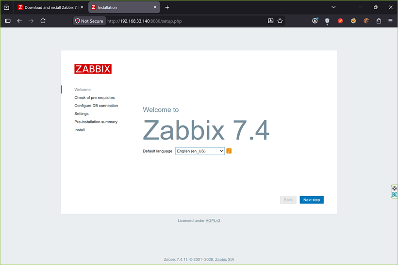
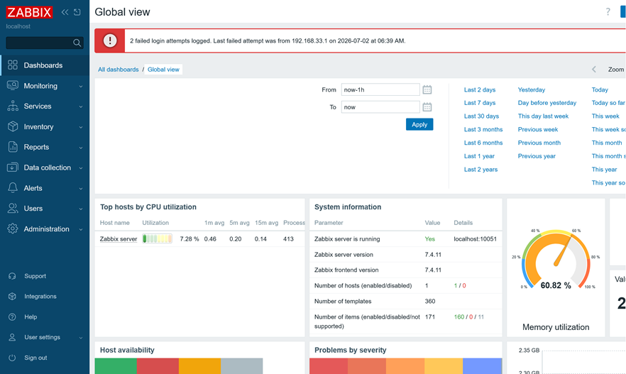
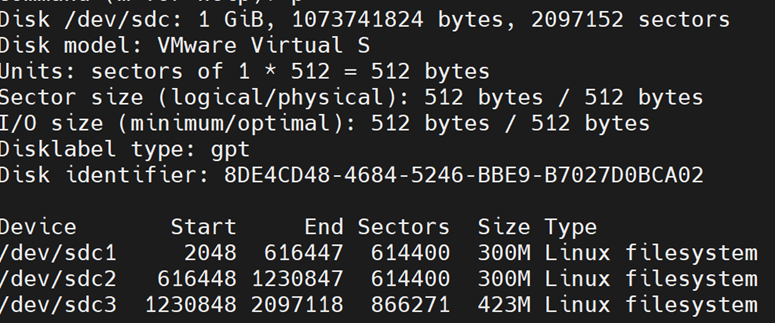
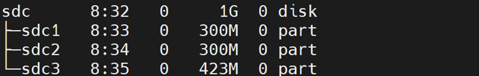
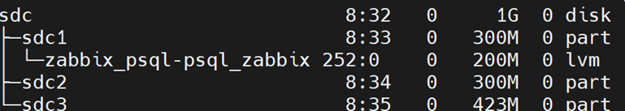
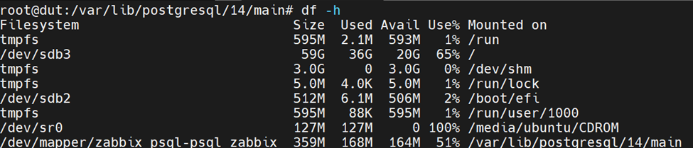

## Installing Zabbix with its Postgres files mounted on a LVM volume
In this setup we will install Zabbix with Postgres and Nginx on Ubuntu 22.04 jammy
1. Ensure that you stopped all other web server and databases beforehand.
2. Install Zabbix according to the manual in the web page.

3. Connect to the Zabbix server using username:Admin and password:zabbix.

4. Execute the following command to get the postgres config files' locations.
```bash
sudo -u postgres psql -c "show data_directory;"
```
5. Add a disk with desired volume (The inital space needed for zabbix in postgres is about 200MB).
6. Make the recenet added disk into three partions.


7. Create three pvs and concats them to create a volume group. Select a logical volume (lv) from this space.

8. We can extend the volume size. Here we add 200MB.
```bash
lvextend /dev/zabbix_psql/psql_zabbix -L+200M -r
```
9. Setup `ext4` filesystem on this logical volume.
```bash
mkfs.ext4 /dev/zabbix_psql/psql_zabbix
```
10. Make a copy of postgres files and mount it to our new partition.
```bash
cp -rp /var/lib/postgresql/14/main /tmp
mount /dev/zabbix_psql/psql_zabbix /var/lib/postgresql/14/main/
cd /var/lib/postgresql/14/main/
rm -rf .
cp -rp /tmp/main/* .
df -h 
```

11. Restart the related services.
```bash
systemctl restart postgresql zabbix-server zabbix-agent nginx php8.1-fpm
```
12. For eternal mounting, we should edit the `/etc/fstab`. We can use the `uuid` command to retreive the disk uuid.
```bash
UUID=* /var/lib/postgresql/14/main ext4 defaults 0 0
```
13. Execute the `mount -a` command to apply `/etc/fstab`.
14. Now we can go and use Zabbix!