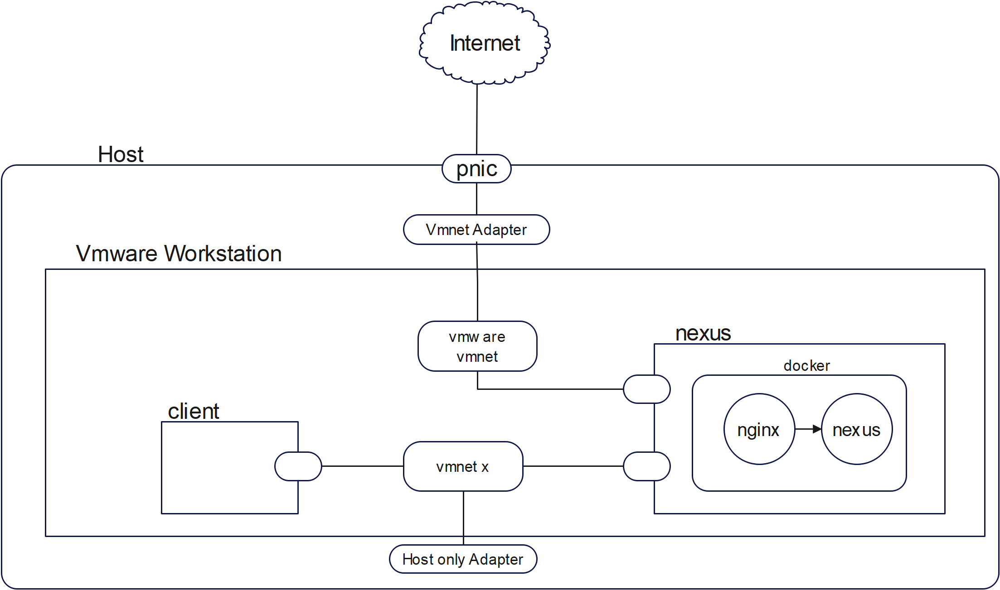
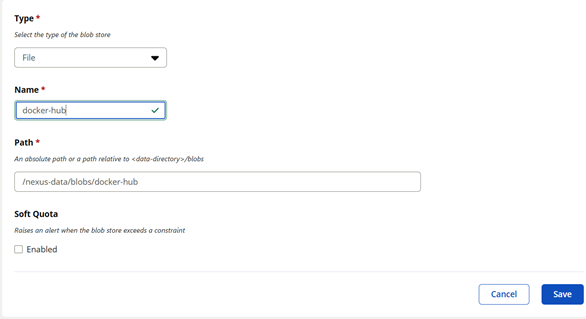
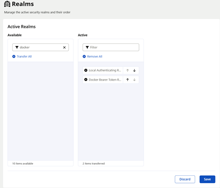
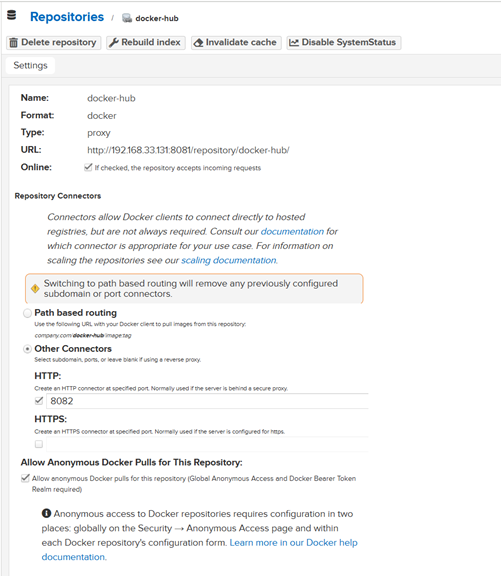
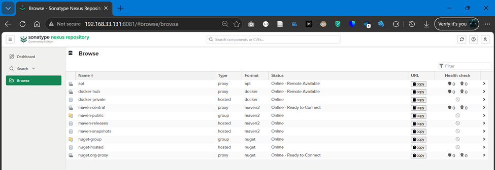

## Nexus repo setup with a apt proxy, docker proxy, docker hosted repo
In this setup we will setup and configure a nexus repo as a container. The nexus repo should act as. For this task, we created two Ubuntu vms, docker installed on both of them. the first machine called `nexus` and host nginx and nexus containers. The second machine is `client` which we use to connect to our nexus repo for pulling/pushing resources. More deatil you can find in the below schematic:


1. Setup `nexus` container
    ```bash
    docker run -d --name nexus --restart always -p 8081:8081 -v nexus_data:/nexus-data -p 8082:8082 
    -p 8083:8083 sonatype/nexus3:3.94.0-alpine
    ```
2. Create 3 blob store in nexus
    
    to be able to pull anonymously, enable `docker bear token`
    
    
3. Create 3 repos
    
      
    NOTE: port 8081 --> Nexus WebUI, 8082 --> docker proxy,  8083 --> docker host
    
4. Set up an `nginx` container to act as a reverse proxy and make our nexus repo accessible via a domain name
    ```bash
    docker run -d  --name nginx --restart always -v ./nginx.conf:/etc/nginx/conf.d/default.conf -p 80:80 nginx:stable-alpine3.24-perl
    ```
    the `nginx.conf` content is as below
    ```yml
    server{
    listen 80;
    server_name nexus.local;

    location / {
        proxy_pass http://192.168.91.129:8081;
        proxy_set_header Host $host;
        proxy_set_header X-Forwarded-Proto $scheme;
    }

        location /docker-hub {
        proxy_pass http://192.168.91.129:8082;
        proxy_set_header Host $host;
        proxy_set_header X-Forwarded-Proto $scheme;
    }

        location /docker-private {
        proxy_pass http://192.168.91.129:8083;
        proxy_set_header Host $host;
        proxy_set_header X-Forwarded-Proto $scheme;
    }
    }
    ```
5. on `client` machine, Execute the below command  to change its `apt` sources
    ```bash
    sudo sed -i   -e 's|ir\.archive\.ubuntu\.com/ubuntu|nexus.local:8081/repository/apt||g' \\
     -e  's|security\.ubuntu\.com/ubuntu|nexus.local:8081/repository/apt||g' \\
     /etc/apt/sources.list
    ```
6. Add the following line to `/etc/docker/daemon.json` to be able to connect to nexus repo without HTTPs
    ```json
    "insecure-registeries"["nexus.local:8082","nexus.local:8083"]
    ```
    Now login to `nexus` docker proxy repo
    ```bash
    docker login nexus.local:8082 -u admin
    ```
7. Now we can pull/push to nexus hosted docker repo, pull from docker proxy, and pull from apt proxy
    ```bash
    docker pull nexus.local:8082/ubuntu:latest
    ```

<< Further reading how to setup ssl on nginx for our domain >>